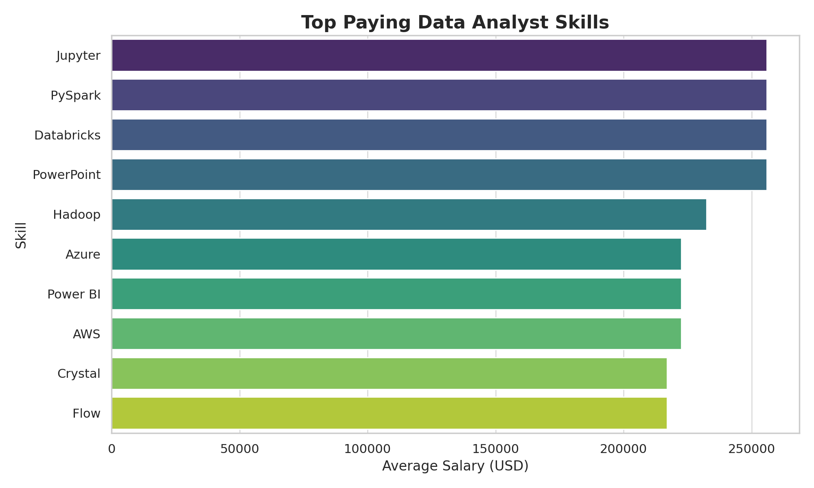
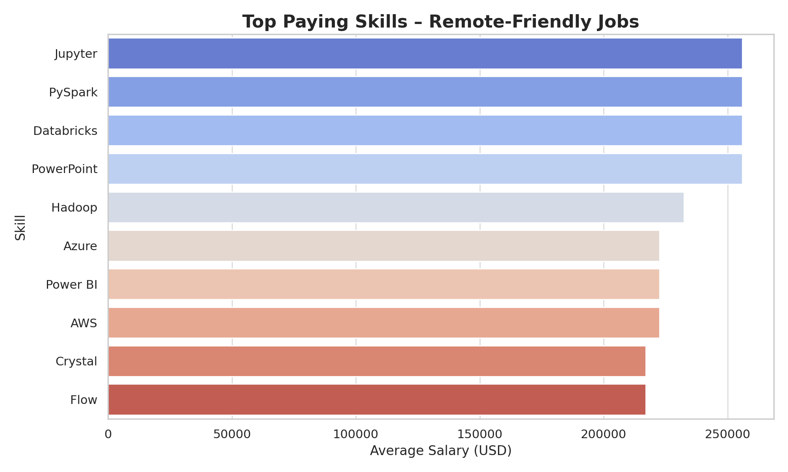
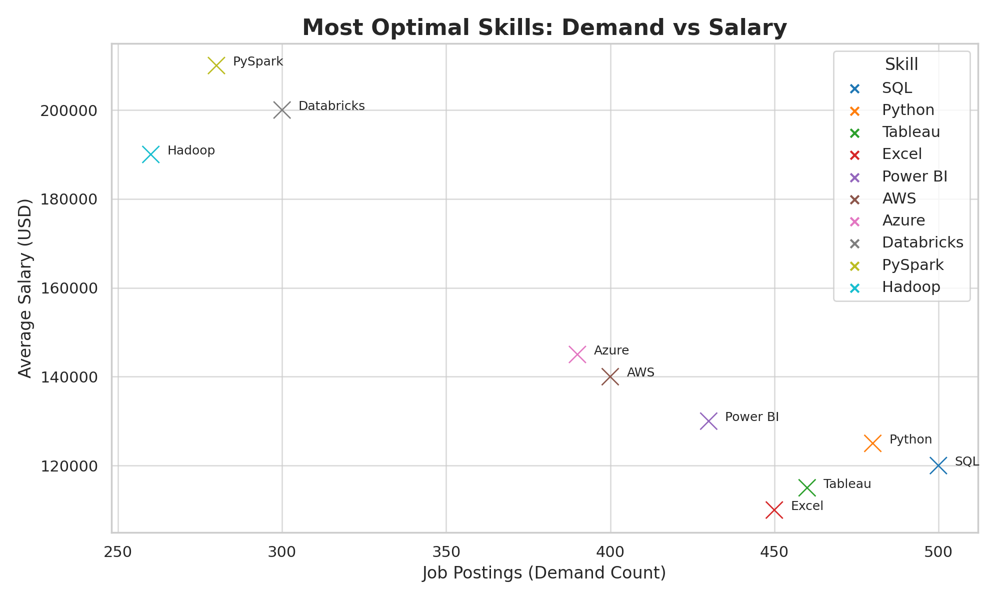

# Introduction 📊
This project explores the top-paying jobs, in-demand skills, and optimal skill sets for Data Analyst roles. Using SQL, I analyzed real job posting data to uncover trends that can guide career planning and hiring strategies

# Background
With the data analytics job market evolving rapidly, it’s crucial to know:

Which skills bring the highest salaries 💰

Which skills are most in demand 📈

How companies differentiate pay based on technical expertise
This project aims to give a clear, data-driven snapshot of these factors for strategic decision-making
# Tools I used
PostgreSQL – for querying and analyzing job posting datasets

SQL Joins, Aggregations, and CTEs – to merge datasets and calculate insights

Data Cleaning in SQL – to filter relevant job titles, salaries, and remote roles

# The Analysis 
Top Paying Jobs & Skills – Identified the highest-paying Data Analyst positions and their required skills
 
 
Top Paying Skills – Found skills with the highest average salary, focusing on remote-friendly jobs

Most Optimal Skills – Combined salary and demand count to pinpoint the most valuable skills for long-term growth

# What I Learned
Top Paying Jobs & Skills – Identified the highest-paying Data Analyst positions and their required skills
.

Top Paying Skills – Found skills with the highest average salary, focusing on remote-friendly jobs
.

Most Optimal Skills – Combined salary and demand count to pinpoint the most valuable skills for long-term growth

# Conclusions
For job seekers: Invest in a hybrid skillset — data engineering + cloud + visualization.

For employers: Competitive pay is essential to attract talent skilled in big data and cloud ecosystems.

The most successful Data Analysts are multi-disciplinary, able to work across data pipelines, visualization, and cloud platforms

# Future Scope🔮 

Role Expansion – Extend the analysis to roles like Data Scientist, Data Engineer, and Business Intelligence Analyst to compare skill trends and pay scales.

Time-Series Analysis – Monitor changes in skill demand and salary over months/years to forecast future market shifts.

Geographic Insights – Break down salaries and demand by location to guide regional hiring and job applications.

Skill Gap Analysis – Identify which high-paying skills are rare among current job seekers to uncover niche opportunities.

Interactive Dashboards – Create real-time dashboards using Power BI or Tableau for live market monitoring.

